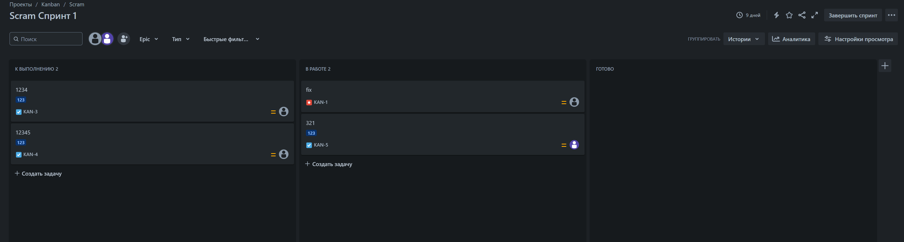
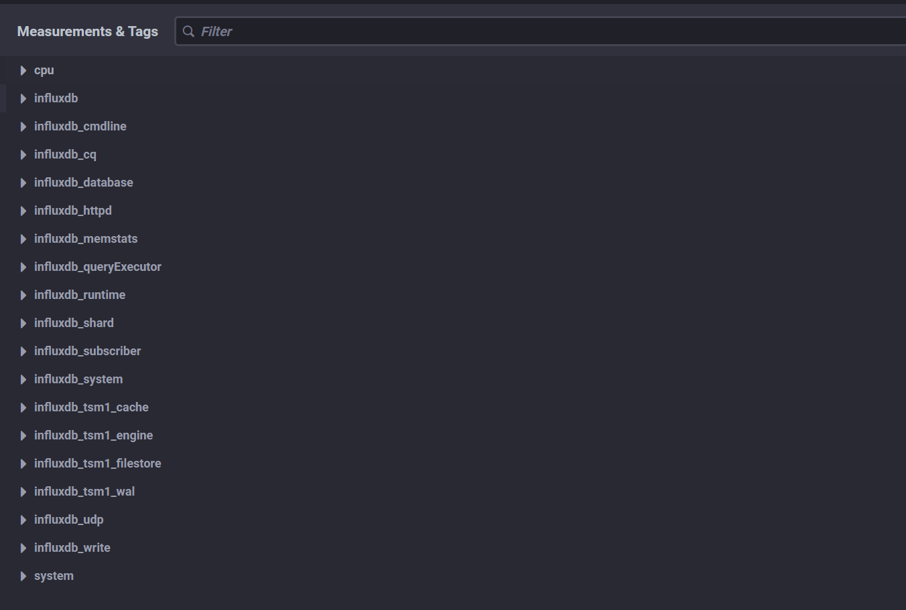

# Домашнее задание к занятию "13.Системы мониторинга" - Баграш Фёдор

1. CPU LA(обработка нагружает CPU) NetTraffic(взаимодействие происходит по http) FS(отчёты загружаются на диск).
2. RAM/inodes/CPUla - эти метрики можно переименовать например в "Нагрузка на процессор" и.т.д. Для отслеживания качества обслуживания можно настроить метрики SLI, SLA и SLO.
3. Я бы настроил логирование в файлы на сервере, также можно настрить отправку ошибок в телеграмм, через API.
4. В данной формуле не учитываются коды 1хх и 3хх из-за них SLA не поднимается выше 70%.
5.
Push:
 - упрощение репликации данных в разные системы мониторинга или их резервные копии
 - более гибкая настройка отправки пакетов данных с метриками
 - UDP — это менее затратный способ передачи данных, из-за чего может возрасти производительность сбора метрик
 - труднее гарантировать, что все агенты корректно настроены и отправляют данные
 - меньше контроля, сервер не может выбирать, какие метрики запрашивать — он принимает то, что присылают агенты\
Pull:
 - легче контролировать подлинность данных
 - можно настроить единый proxy server до всех агентов с TLS
 - упрощённая отладка получения данных с агентов
 - сложность мониторинга больших сетей
 - высокая нагрузка при большом колличестве агентов
6. Prometheus - Pull
TICK - Push
Zabbix - Push и Pull
VictoriaMetrics - Push и Pull
Nagios - Pull
7. 

8. 

9. 

