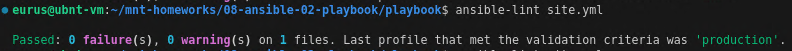
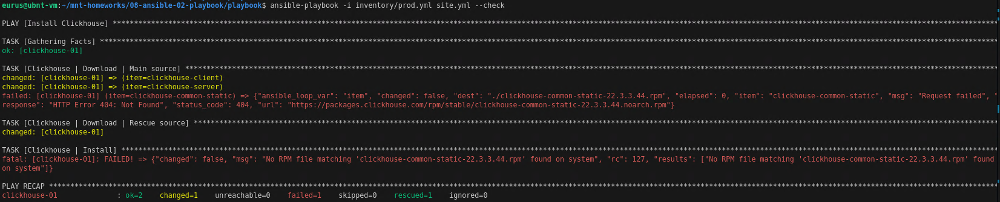
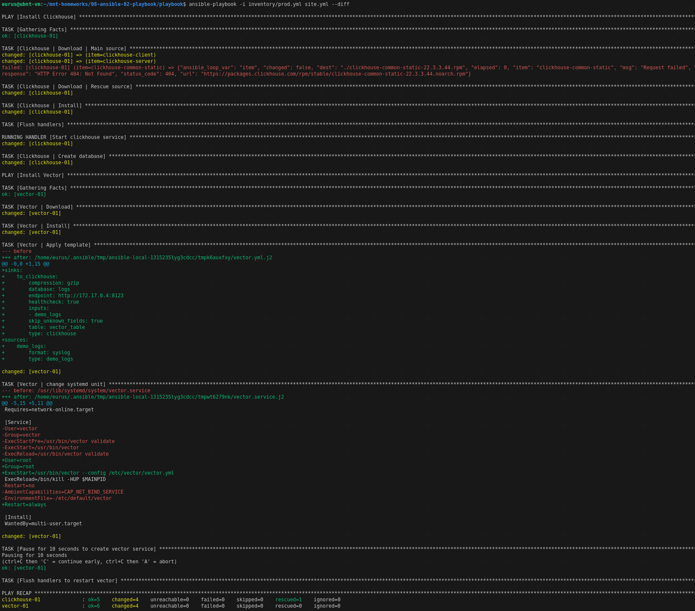
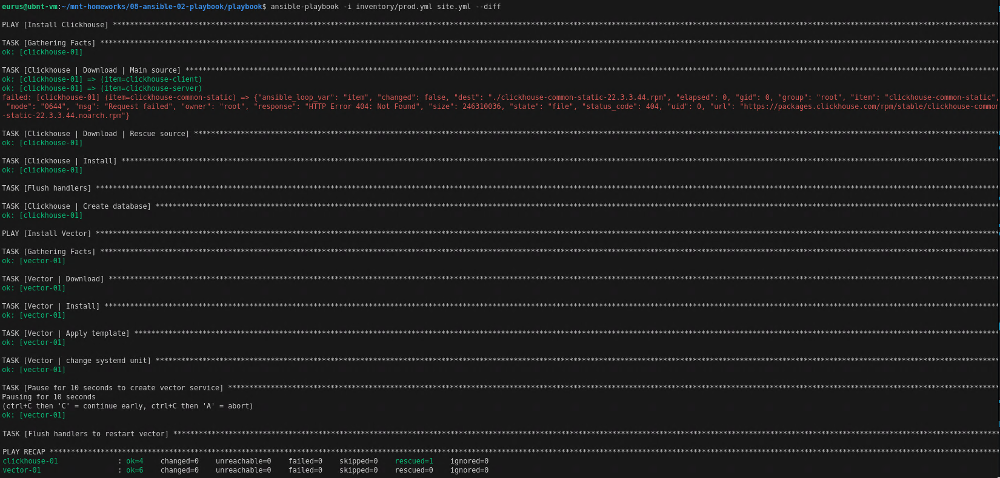

# Домашнее задание к занятию "Работа с Playbook" - Баграш Фёдор

Запуск `ansible-lint site.yml`

Ошибки:
- Не задано имя task
- Не заданы права на файл
- Для встроенного модуля использовано короткое имя вместо полного имени коллекции
- Отсутствует пустая строка в конце файла

Предупреждения:
- Неподдерживаемый параметр
- Отсутствие пробела в шаблоне

Исправление и повторный запуск `ansible-lint site.yml`

6. При запуске с флагом `--check` возникает ошибка в таске установки clickhouse, поскольку `--check` выполняет только проверку, но не сами действия. Соответственно, он не скачивает дистрибутив в предыдущем таске

7. Первый запуск на `prod.yml` окружении с флагом `--diff`

8. Повторный запуск playbook с флагом `--diff` — изменений нет, playbook идемпотентен

9. Ссылка на описаниее Playbook

https://github.com/tud777777/git_homework/blob/main/playbook/Readme.md
